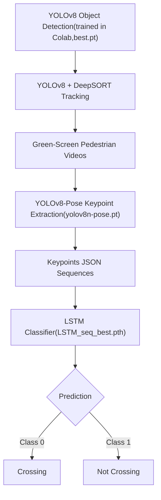
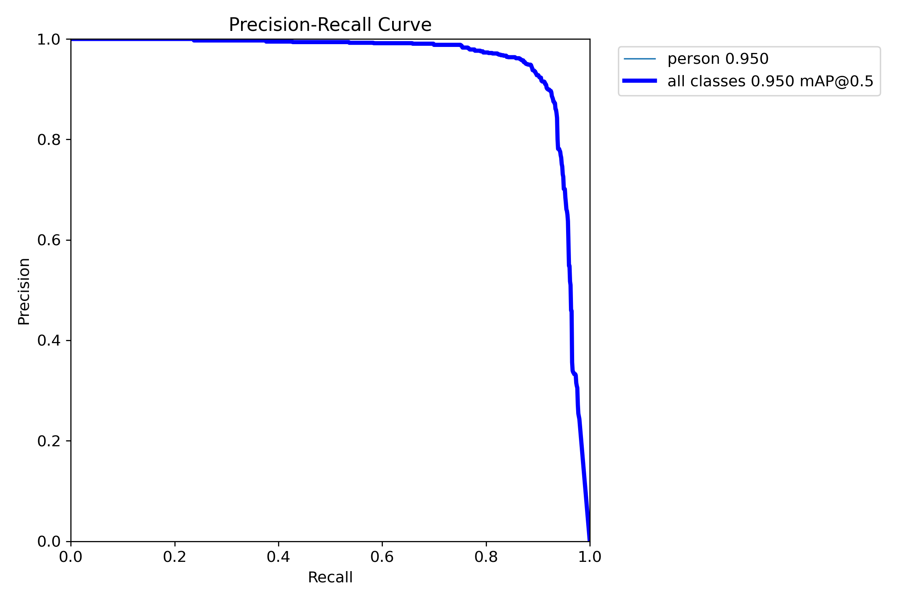
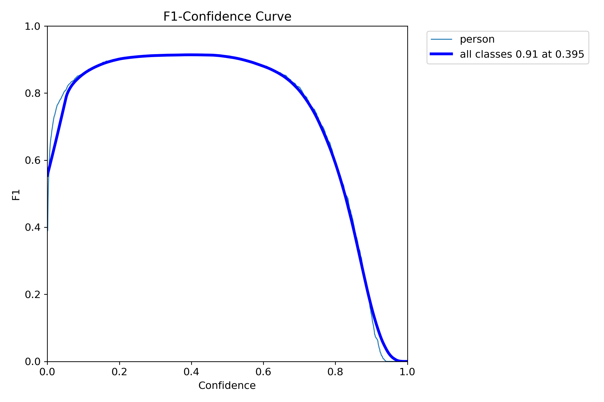
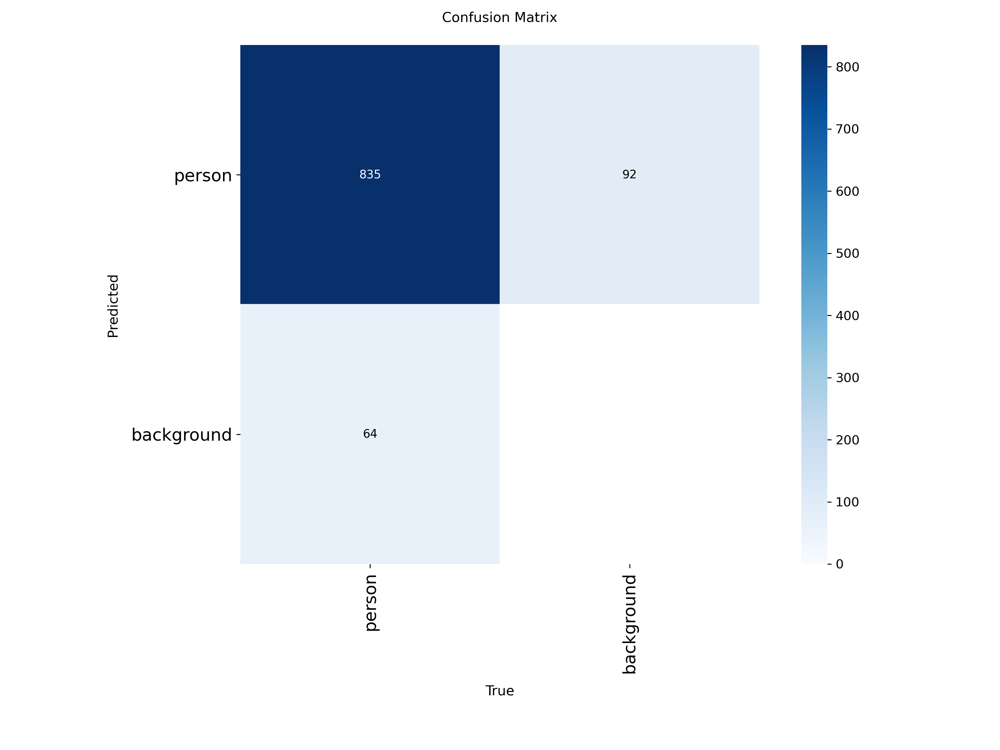
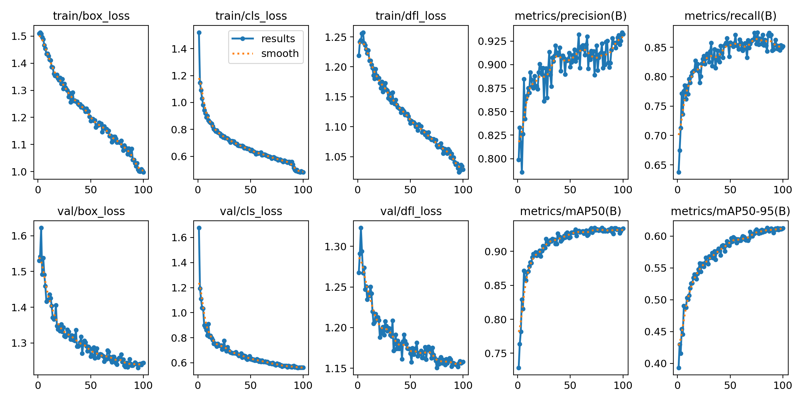
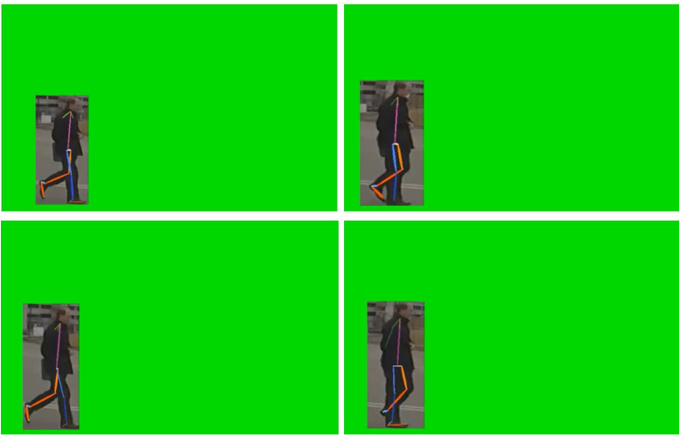
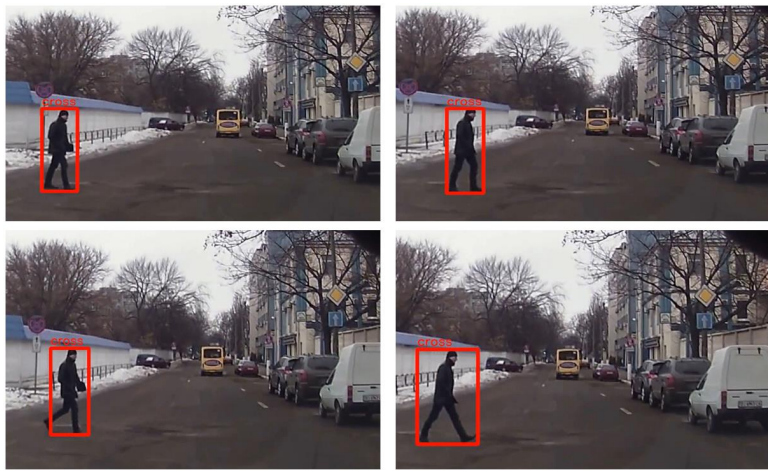

# Pedestrian Crossing Detection (YOLOv8 + DeepSORT + LSTM)

This project implements a **pedestrian crossing behavior recognition system**, combining **YOLOv8 object detection**, **DeepSORT tracking**, **YOLOv8-Pose keypoint extraction**, and an **LSTM classifier**.  
The pipeline detects pedestrians in surveillance videos, tracks their movement, extracts body keypoints, and predicts whether a pedestrian is **crossing the street** or **not crossing**.

*This project was part of my Bachelor thesis, demonstrating experience in **Computer Vision**, **Deep Learning**, and **Behavior Recognition**.*

---

##  Pipeline Overview

1. **YOLOv8 Object Detection**  
   - Trained YOLOv8 model to detect pedestrians.  
   - Exported weight file `best.pt`.  

2. **YOLOv8 + DeepSORT Tracking**  
   - Applied object detection + tracking on video datasets.  
   - Generated green-screen videos (pedestrian foreground only).  

3. **YOLOv8-Pose Keypoint Detection**  
   - Extracted human pose keypoints from videos.  
   - Saved as JSON for each video.  

4. **LSTM Sequence Classification**  
   - Input: keypoint sequences  
   - Output: pedestrian behavior classification (**cross / not cross**)  
   - Trained LSTM classifier → best checkpoint: `LSTM_seq_best.pth`.
## Pipeline Diagram


---

##  Results

### YOLOv8 Object Detection
- Precision-Recall Curve 

  
- F1-Confidence Curve

  
- Confusion Matrix (YOLOv8 Detection)

  
- Training Curves  
  
   

### LSTM Classification
- Confusion Matrix

    
- Training & Validation Loss

  
- Classification Metrics

  
### Example outputs:

- Green-screen with pose keypoints:  
    

- Final behavior classification (crossing):  
    
---

##  How to Run

### 1. Install Dependencies
```bash
pip install -r requirements.txt
```
### 2. Dataset Preparation
Place your videos into:
```bash
2-Deepsort_Tracking/datasets/videos/cross/
2-Deepsort_Tracking/datasets/videos/notcross/
```
### 3. YOLOv8 + DeepSORT Tracking
The YOLOv8 object detection model was trained in Google Colab using Ultralytics' YOLOv8 framework.
```bash
python 2-Deepsort_Tracking/batch_track_and_cut.py
```
### 4. YOLOv8-Pose Keypoint Extraction
```bash
python 3-YOLOv8Pose+LSTM predict/batch_predict.py
```
### 5. Train LSTM
```bash
python 3-YOLOv8Pose+LSTM predict/1-LSTM train.py
```
### 6. Predict Single Video
```bash
python 3-YOLOv8Pose+LSTM predict/2-predict.py
```
---
## Notes

The original dataset (videos) is not included due to size limits.

Example results are provided.

YOLOv8 training was performed on Google Colab, using Ultralytics YOLOv8 framework.
